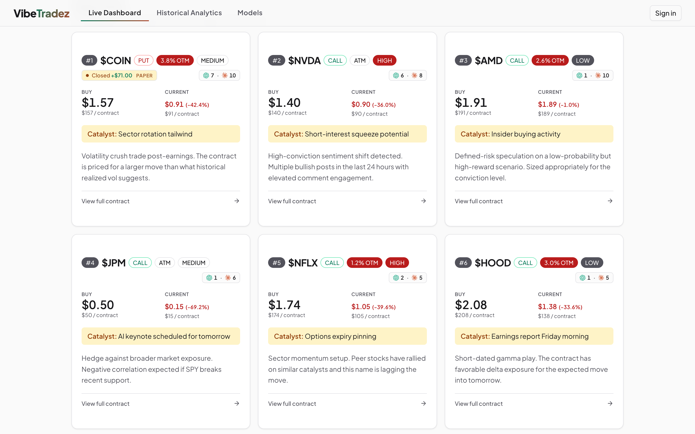
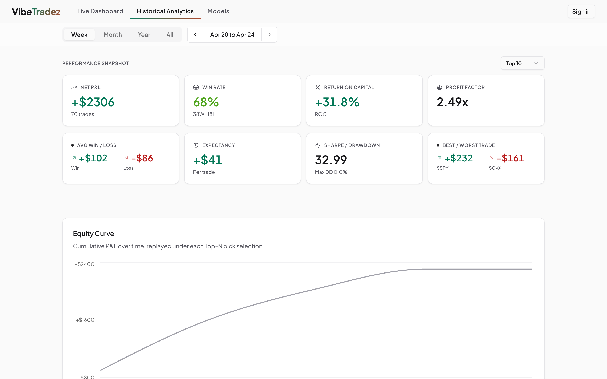
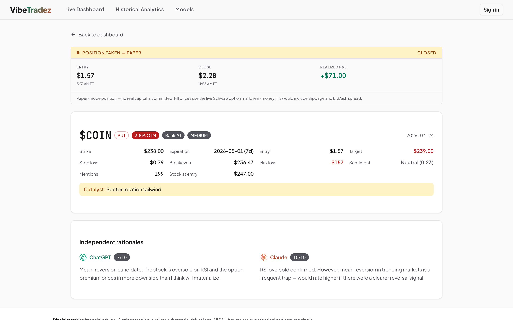
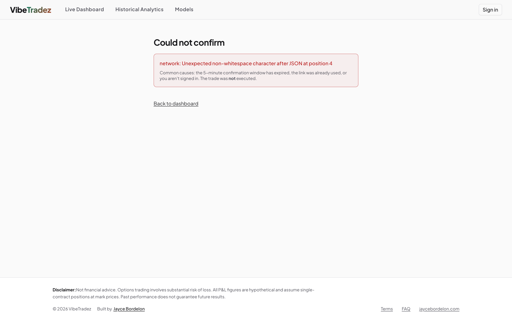
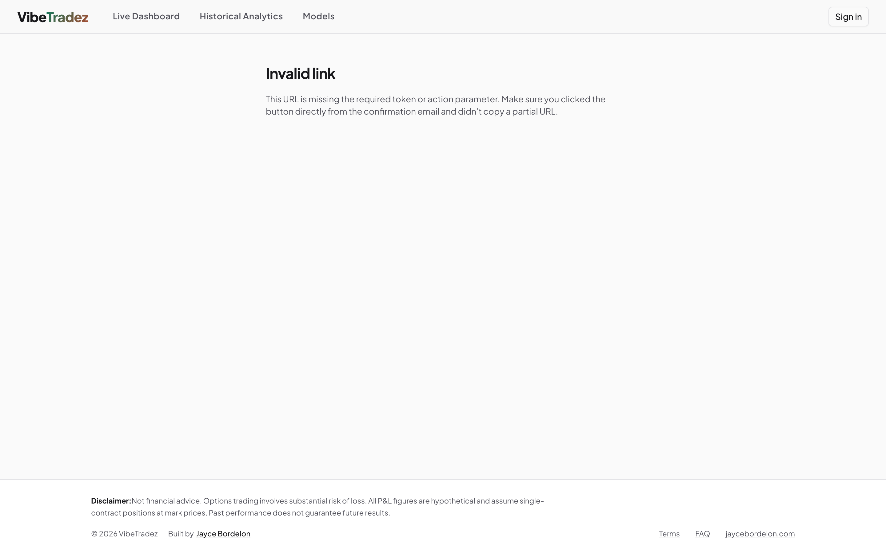

# Auto-execution UI — visual proof

Five real screenshots captured against the local docker stack with seed data, exercising the new auto-execution feature shipped in [PR #43](https://github.com/JayceBordelon/jaycestuff/pull/43).

All five fit on one screen — full-width on mobile, 2-column on desktop.

<table>
<tr>
<td width="50%" valign="top">
<a href="screenshots/01-dashboard-execution-badge.png"></a>
<p><b>1. Dashboard — execution badge</b><br/><sub>The amber <code>● Closed -$71.00 PAPER</code> pill on the rank-1 COIN PUT card. Mode is always rendered next to state so paper is never mistaken for a real position.</sub></p>
</td>
<td width="50%" valign="top">
<a href="screenshots/02-history-execution-badges.png"></a>
<p><b>2. History — multi-day badges</b><br/><sub>Days where Jayce took a position get a badge inline with the date. Mix of paper closed-win, paper closed-loss, and live closed visible across recent days.</sub></p>
</td>
</tr>
<tr>
<td width="50%" valign="top">
<a href="screenshots/03-trade-detail-execution-panel.png"></a>
<p><b>3. Trade detail — full execution panel</b><br/><sub>4-stat panel (entry / close / realized P&amp;L) with timestamps and the paper-mode disclaimer below — paper fills are at the live mark, real fills include slippage.</sub></p>
</td>
<td width="50%" valign="top">
<a href="screenshots/04-execute-error-state.png"></a>
<p><b>4. /execute — could-not-confirm</b><br/><sub>What you see if a token is tampered, expired, or already used. The trade was <strong>not</strong> executed; "Back to dashboard" link is sized for tap (≥44px tall on mobile, fixed in this PR).</sub></p>
</td>
</tr>
<tr>
<td width="50%" valign="top">
<a href="screenshots/05-execute-invalid-link.png"></a>
<p><b>5. /execute — invalid link</b><br/><sub>Visited <code>/execute</code> directly without the signed token + action query params. Clean error state instead of a crash; happens if a partial URL gets pasted.</sub></p>
</td>
<td width="50%" valign="top"></td>
</tr>
</table>

## How these were captured

```bash
cd vibetradez.com/local && docker compose -f docker-compose.local.yml up --build -d
cd scripts/ux-audit && node feature-screenshots.mjs
```

Output lands in `scripts/ux-audit/feature-output/`. Same harness also captures the production `/opengraph-image.png` (replaced the synthetic next/og card with a real dashboard screenshot — see [PR #43](https://github.com/JayceBordelon/jaycestuff/pull/43) for that wiring).

## What's NOT in here

- The 5-minute confirmation email itself (it's HTML in `vibetradez.com/server/internal/templates/execute_confirm.html` — render it locally with the existing `cmd/preview-email` tool).
- The "✓ Trade execution confirmed" success state on `/execute` — requires a real signed HMAC token + authenticated session, can only be captured during a live qualifying-pick fire.
- The 4 receipt emails (open fill, decline, close receipt, close-failed alert) — also templates that need real triggers.
